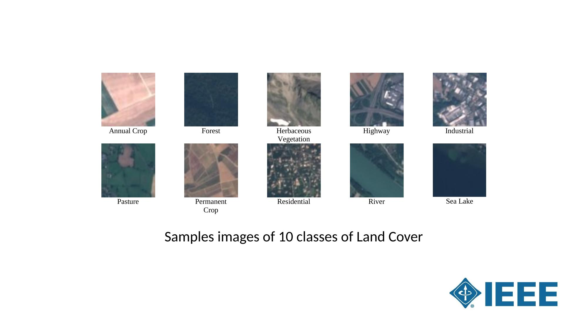
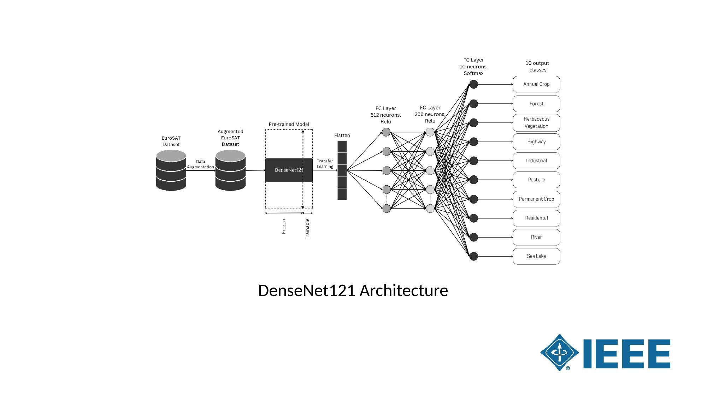
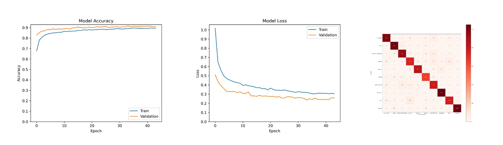

# A Lightweight Deep Learning Framework for Land Cover Classification from Sentinel-2 Imagery

[](https://ieeexplore.ieee.org/document/11140199)

> **Authors:** Dev Pathak, Poojan Brahmbhatt & Parth Goel
> Presented at the **6th International Conference of Emerging Technologies (INCET 2025)**, Jain College of Engineering, Belagavi, Karnataka, India.
> 📄 [Read the paper on IEEE Xplore](https://ieeexplore.ieee.org/document/11140199)

---

## Overview

Land cover classification is a critical task in ecological monitoring, natural resource conservation, and urban planning. This study presents a lightweight deep learning framework that applies transfer learning with a pre-trained **DenseNet121** model on the **EuroSAT dataset**, which consists of labeled Sentinel-2 satellite imagery.

The framework is designed to balance classification accuracy with computational efficiency, making it practical for real-world remote sensing applications. It achieved a training accuracy of **89.33%** and a validation accuracy of **90.79%**, outperforming comparable lightweight models while using significantly fewer non-trainable parameters and a smaller model size.

---

## Dataset

The **EuroSAT dataset** is derived from Sentinel-2 multispectral imagery provided by the Copernicus Earth Observation Program. It contains **27,000 labelled images** distributed across **10 land cover classes**, each captured at a ground resolution of 10 meters per pixel. The dataset was split into **80% training, 10% validation, and 10% testing**.

The 10 land cover classes are: Annual Crop, Forest, Herbaceous Vegetation, Highway, Industrial, Pasture, Permanent Crop, Residential, River, and Sea Lake.



---

## Model Architecture

The framework uses **DenseNet121** as the base pre-trained feature extractor, with its weights frozen during transfer learning. On top of the frozen base, two fully connected (Dense) layers with 512 and 256 neurons (ReLU activation) were added, followed by a final output layer with 10 neurons and a Softmax activation to classify the 10 land cover classes.

Training was conducted for **100 epochs** with a batch size of 32, an initial learning rate of 0.001, using **Adam** as the optimizer and **categorical cross-entropy** as the loss function. All images were resized to 64×64 pixels before being fed into the network.



---

## Results

DenseNet121 was benchmarked against ResNet50 and EfficientNetB2 under identical experimental conditions.

| Model | Training Accuracy | Validation Accuracy | Precision | Recall | F1-Score | Model Size |
|---|---|---|---|---|---|---|
| **DenseNet121** | **89.33%** | **90.79%** | **92.00%** | **91.00%** | **91.00%** | **53.5 MB** |
| EfficientNetB2 | 87.23% | 88.40% | 89.14% | 89.55% | 90.08% | 53.2 MB |
| ResNet50 | 67.14% | 64.12% | 65.21% | 64.34% | 64.86% | 105.4 MB |

DenseNet121 achieved the highest classification accuracy and precision while maintaining a compact model size of 53.5 MB — less than half the size of ResNet50 at 105.4 MB. The training and validation accuracy curves converge smoothly, indicating stable training without significant overfitting.



---

## Experimental Setup

- **Environment:** Google Colab
- **GPU:** Tesla T4
- **Language:** Python 3.10
- **Key Libraries:** TensorFlow, Keras, NumPy, Pandas, Matplotlib
- **Data Source:** EuroSAT dataset via Kaggle

---

## Repository Structure

```
├── Models/     # Jupyter Notebooks with model training and evaluation
└── README.md
```

---

## Future Scope

The proposed model can be further optimized for deployment on edge devices such as drones or IoT systems, enabling real-time land cover monitoring in remote and resource-constrained environments.
